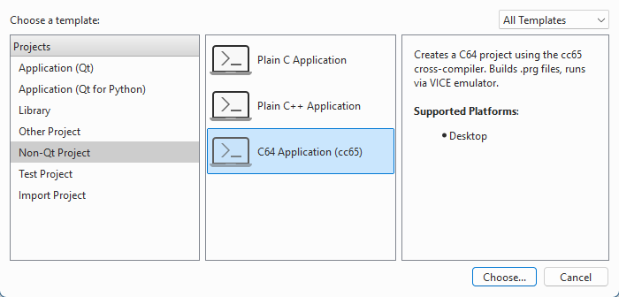
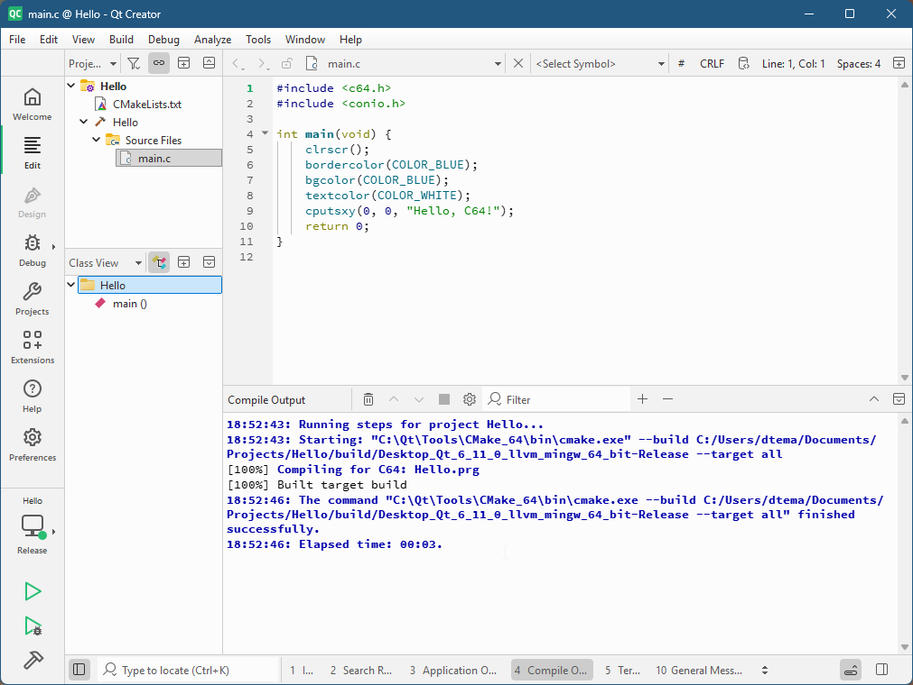

# C64 Application (cc65) — Qt Creator Wizard Template

A Qt Creator project template for developing Commodore 64 applications using the **cc65** cross-compiler, with one-click build & run via a C64 emulator.

## What it provides

- **CMake-based build system** — Desktop kit (GCC) drives CMake; `cl65` compiles C sources to `.prg`
- **Run button integration** — Run C64 applications in an emulator directly from Qt Creator using the Run button
- **Clang code model compatibility** — a patched `include/c64.h` prevents red squiggly lines from the Clangd model

## Prerequisites

| Tool | Purpose |
|------|---------|
| **Qt Creator** 16+ | Tested on 19.0.2; `FOLDER "qtc_runnable"` requires Qt Creator 16+ |
| **CMake** 3.20+ | Usually bundled with Qt Creator |
| **cc65** (>= 2.19) | C64 cross-compiler (`cl65` must be in PATH) |
| **VICE** (or any C64 emulator) | Emulator application |

cc65 system headers are expected at a platform-specific default path:

| Platform | Path |
|----------|------|
| Linux | `/usr/share/cc65/include` |
| macOS | `/opt/homebrew/share/cc65/include` |
| Windows | `C:/cc65/include` |

## Installation

Copy the entire `cc65-c64` directory into Qt Creator's project templates folder:

- Linux:
  ```bash
  cp -r cc65-c64 $HOME/Qt/Tools/QtCreator/share/qtcreator/templates/wizards/projects/
  ```
- Windows (Command Prompt):
  ```cmd
  xcopy /E cc65-c64 C:\Qt\Tools\QtCreator\share\qtcreator\templates\wizards\projects\cc65-c64\
  ```
- macOS
```
  Copy cc65-c64 folder to '/Users/????/Qt/Qt Creator.app/Contents/Resources/templates/wizards/projects/cc65-c64'
```

Restart Qt Creator. The template appears under **File → New Project → Non-Qt Project → C64 Application (cc65)**.

## Usage

1. **File → New Project → Non-Qt Project → C64 Application (cc65)**
2. Choose a name and location
3. Select the **Desktop** kit (GCC) — not a cross-compiler kit
4. Click **Finish**
5. Click **Build** (hammer icon) → compiles with `cl65`
6. Click **Run** (play icon) → launches the emulator application with the compiled `.prg`

## Generated files

When a project is created, the following files are produced:

- `CMakeLists.txt` — CMake project definition (open as project root)
- `cc65-toolchain.cmake` — toolchain file (not used by Desktop kit; present for reference)
- `<name>.c` — sample `main.c` with a "Hello, C64!" demo
- `include/c64.h` — patched system header for Clangd compatibility

## File structure

```
cc65-c64/
├── CMakeLists.txt           # Template with %{...} Qt Creator variables
├── cc65-toolchain.cmake     # CMake toolchain file for reference
├── include/
│   └── c64.h                # Patched system header
├── main.c                   # Sample source file
└── wizard.json              # Qt Creator wizard definition
```




